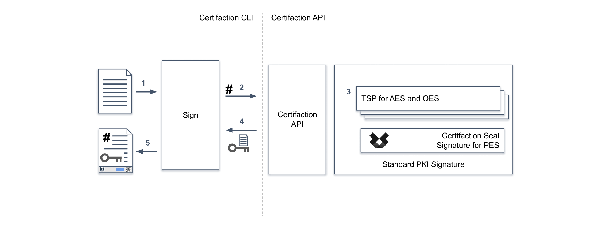

# Digital Signature

Certifaction's digital signature allows users to add one or more digital signatures to PDF documents.

Certifaction document signatures are based on the [PAdES](https://en.wikipedia.org/wiki/PAdES) standard,
which uses cryptography and Public Key Infrastructure (PKI) to provide the highest guarantee against forgery.

Certifaction uses three signature levels with increasing identity verification assurances:

- Standard Electronic Signature (SES): email verification
- Professional Electronic Signature (PES): identification using ID document scanning and verification
- Qualified Electronic Signature (QES): Swiss and EU qualified electronic signature requirements

Certifaction's unique privacy-first signature ensures that document content does not leave your
IT infrastructure in clear text.

## Simple document signature

Here are the steps during a simple document signature:

1.  The CLI receives the PDF document to sign and process it (adds security features including a unique secure URL and one or more signature
    pages).
2.  The hash of the file is sent to Certifaction API for signature.
3.  The Certifaction API uses one of its pluggable signature providers depending on the signature level and jurisdiction.
4.  The Certifaction API returns the PKCS #7 CMS signature to the CLI.
5.  The CLI embeds the signature in the PDF document and returns it to the user.

Additional signatures can be appended to an already signed document sequentially. Sending a signed document to an
other signer is a simple and valid option.

